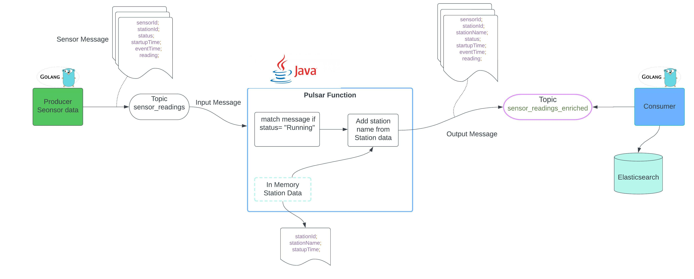
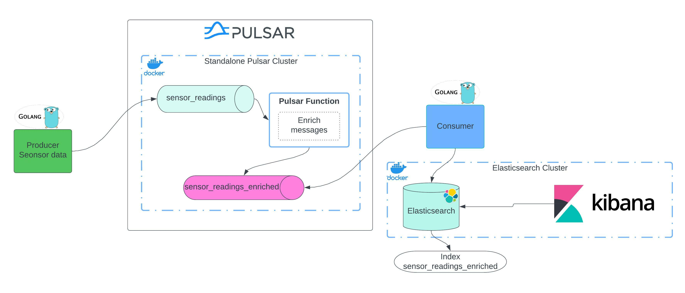

# Pulsar-data-pipeline-project

## Overview 

This project is to implement a Streaming Data Pipeline using Apache Pulsar that does the following:

1. Ingests **SensorReading** records inside a Pulsar topic called `sensor_readings` Topic, using JSON schema. Data is ingested to this Topic using Golang [producer](src/goapps/producer/producer.go) which generate sensor data.
 
2. There is Pulsar [Function](src/pulsarfunction/streamnative-se-challenge-master/src/main/java/io/streamnative/function/EnrichmentFunc.java) that listens on the **sensor_readings** topic and applies the following logic:
    - checks the SensorReading and skips the record if it's in an `Inactive` State
    - If it's a **Running** State - it extracts the station id, performs a lookup to fetch the StationData and creates a new **ReadingEnriched** record and writes it to the **sensor_readings_enriched** topic.
   
3. Once the data is in **sensor_readings_enriched**, we write the messages from the **sensor_readings_enriched** topic into some Elasticsearch. Data is ingested into Elasticsearch using [consumer](src/goapps/consumer/consumer-enrichdata-to-es.go) we have written in Golang.

### Logical design of the App 

Below is the logical flow how data flow between toipcs on pulsar and ingested into Elasticsearch.



### Physical Design 

1. We use pulsar as our data straeming platform . As part of this project we deploy Standalone Pulsar cluster which is bundled with broker,Bookie and zookeeper in the same docker container. For Production it is recomnded to deploy a full cluster.
2. Elasticsearch is deployed as the single node cluster. Deployment instuctions are provided in deployment section.  
3. We also deploy kibana as part of this project to visualize the data easily once its ingested in Elasticsearch. 
4. For deployment of microserivices we have provided binary for linux and mac. 




# Deployment Instructions 

Below section provide the instruction to deploy full data pipeline. Make sure to install docker and docker-compose to deploy pulsar and elasticsearch cluster 


### Setup Standalone Pulsar Cluster


### Create Docker Network

Create Docker network, make sure the network is added otherwise some services wont be able to communicate. 

```
docker network create network_test_bed || true

```
### Deploy the pulsar cluster 

From the root of the repo folder run the following command to spin the pulsar cluster 

```
docker-compose -f deployment/pulsar/docker-compose.yml up -d

```


Note: As part of the docker-compose we also deploy pulsar-manager . To setup pulsar-manager follow the instruction on the [blog](https://jpinjpblog.wordpress.com/2020/12/10/pulsar-with-manager-and-dashboard-on-docker-compose/#:~:text=Accessing%20the%20Pulsar%2DManager,%3A%2F%2F127.0.0.1%2F%23%2Fenvironments.&text=You%20could%20create%20a%20super,command%2C%20to%20access%20the%20dashboard.)

After running docker compose the out should look similar to below 

```

docker ps

CONTAINER ID   IMAGE                       COMMAND                  CREATED          STATUS          PORTS                                                 NAMES
d5ce76e222c2   apachepulsar/pulsar-manager:v0.2.0                     "/pulsar-manager/ent…"   3 days ago   Up 3 days    0.0.0.0:7750->7750/tcp, 0.0.0.0:9527->9527/tcp   pulsar_pulsar-manager_1
5234608d4d81   apachepulsar/pulsar:2.9.2                              "bin/pulsar standalo…"   3 days ago   Up 3 hours   0.0.0.0:6650->6650/tcp, 0.0.0.0:8080->8080/tcp   pulsar_pulsar-cluster_1
```

### Deploy Elasticsearch Cluster 
From the root of the repo folder run the following command to spin the Elasticsearch cluster

```
docker-compose -f deployment/elasticsearch/docker-compose.yml up -d

```
check the elasticsearch is up and running.  In total we should have 4 continer running. 
```

docker ps

CONTAINER ID   IMAGE                                                  COMMAND                  CREATED      STATUS       PORTS                                            NAMES
2d59643e9c5c   docker.elastic.co/elasticsearch/elasticsearch:7.14.0   "/bin/tini -- /usr/l…"   2 days ago   Up 2 days    0.0.0.0:9200->9200/tcp, 9300/tcp                 elastic-node1
f9d947f9b9c0   docker.elastic.co/kibana/kibana:7.14.0                 "/bin/tini -- /usr/l…"   2 days ago   Up 2 days    0.0.0.0:5601->5601/tcp                           kibana
d5ce76e222c2   apachepulsar/pulsar-manager:v0.2.0                     "/pulsar-manager/ent…"   3 days ago   Up 3 days    0.0.0.0:7750->7750/tcp, 0.0.0.0:9527->9527/tcp   pulsar_pulsar-manager_1
5234608d4d81   apachepulsar/pulsar:2.9.2                              "bin/pulsar standalo…"   3 days ago   Up 3 hours   0.0.0.0:6650->6650/tcp, 0.0.0.0:8080->8080/tcp   pulsar_pulsar-cluster_1
```

## Produce data to Pulsar cluster 


1. Producer is written in Golang you always further change suits your need. To make changes check the code [producer](src/goapps/producer/producer.go)
1. Open a new terminal window.
1. Use the producer located in “deployment/microservices/producer” folder and run the following command to run the producer. Producer generate 1000 messages by default if you dont provide `-it` parameter to  the topic `sensor_readings` topic. You can always rerun to generate more messages. 

```
./deployment/microservices/producer/producer -it=500 

```

Note : `-it` controle how manay messages you can produce to the pulsar cluster 

## Deploy Pulsar Function 

1. Pulsar function can be deployed different ways, for more instruction follow the [link](https://pulsar.apache.org/docs/functions-deploy/). For this excerise we use a very simple way to copy the function to the pulsar container and run on our stand alone cluster. This is not recomended for the production deployment. 
2. Open a new terminal window, keep the producer window open as you may need to run the producer again.
3. Note the id of your Pulsar container using the following command. As you can see my Id is `5234608d4d81`, you may have different id  

```

docker ps

CONTAINER ID   IMAGE                                                  COMMAND                  CREATED      STATUS       PORTS                                            NAMES
5234608d4d81   apachepulsar/pulsar:2.9.2                              "bin/pulsar standalo…"   3 days ago   Up 3 hours   0.0.0.0:6650->6650/tcp, 0.0.0.0:8080->8080/tcp   pulsar_pulsar-cluster_1
```

#### copy  the Pulsarfunction jar file to Pulsar docker conainter.

Replace the docker id `5234608d4d81` from your docker id . Run this commmand from the root of the repo. 

```
docker cp deployment/microservices/pulsarFunction/streamnative-se-challenge-0.1.0-jar-with-dependencies.jar 5234608d4d81:/pulsar

```

#### Exec into the container

```
docker exec -it 5234608d4d81 /bin/bash
```
once you are inside the container write `ls -ltr` to confirm the file is copied inside the container. 

#### Start the Pulsar Function 

```
bin/pulsar-admin functions create \
--jar /pulsar/streamnative-se-challenge-0.1.0-jar-with-dependencies.jar \
--classname io.streamnative.function.EnrichmentFunc \
--tenant public \
--namespace default \
--name EnrichmentFunc \
--inputs persistent://public/default/sensor_readings \
--output persistent://public/default/sensor_readings_enriched

```
You should get the confirmation on the window that the function is started succesfully. Keep this window open. 

## Consumer data from test Confluent Cluster

1. Open a new terminal window 
2. Use the following command to run the consumer. Consumer is written to consumer messages and ingest into Elasticsearch. So make sure the Elasticsearch cluster is running. 


```
./deployment/microservices/consumer/consumer-enrichdata-to-es

```
You can produce more data onnce the full pipeline is working to see more message appearing on the consumer. 


## Open Kibana to confirm the data is in Elasticsearch 

1. We have also deployed Kibana to confirm the the data is in Elasticsearch. Open your browser and enter http://localhost:5601/app/home#/ to open kibana
2. We ingest data on the `sensor_readings_enriched`, For the new Kibana installtion in order to view the data in the discovery pan you have to add the index pattern. Following the insction to add the index pattern.

[Add Index Pattern](https://www.elastic.co/guide/en/kibana/7.17/index-patterns.html#:~:text=Create%20an%20index%20patternedit,-If%20you%20collected&text=Open%20the%20main%20menu%2C%20then,sources%2C%20use%20a%20wildcard%20(*).)


### Shut the Pulsar cluster

Once you have succesully tested the pipeline shutdown Pulsar and elasticsearch cluster 


```
docker-compose -f deployment/pulsar/docker-compose.yml down

```

### Shutdown Elasticsearch 

Also shutdown Elasticsearch .


```
docker-compose -f deployment/elasticsearch/docker-compose.yml down

```
